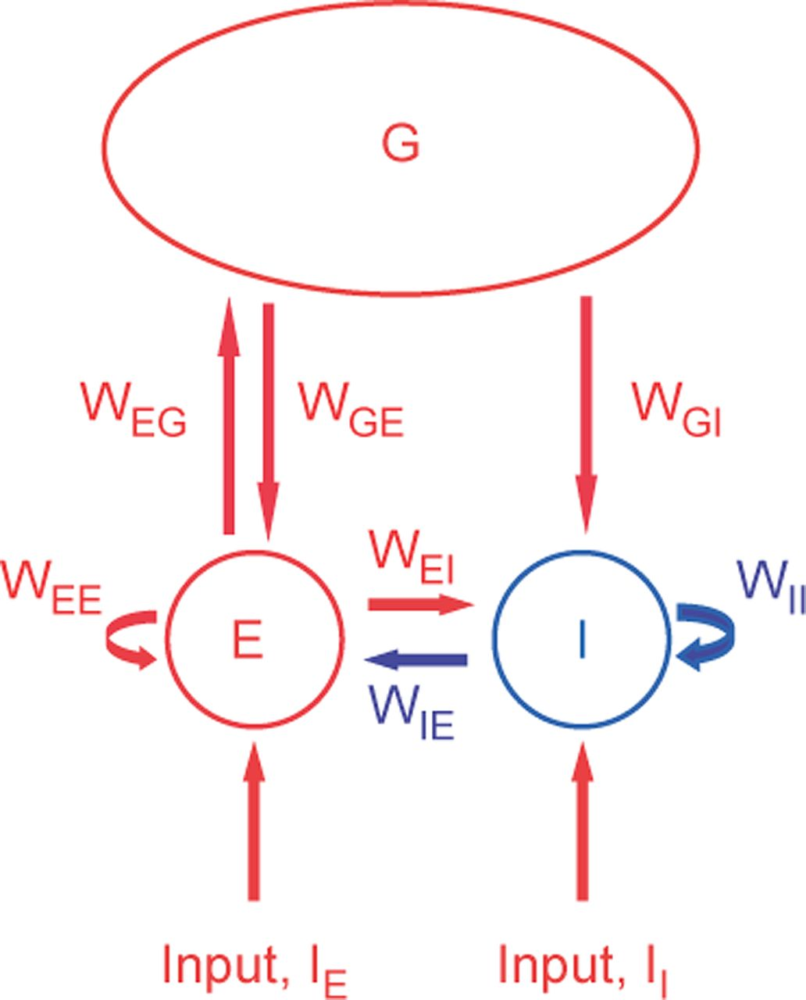

# gamma_model
matlab code for recurrent model to simulate gamma oscillation

Copyright (C) 2013 Xiaoxuan Jia, Dajun Xing and Adam Kohn

This program is free software: you can redistribute it and/or modify it under 
the terms of the GNU General Public License as published by the Free Software 
Foundation, either version 3 of the License, or (at your option) any later 
version.

This program is distributed in the hope that it will be useful, but WITHOUT ANY
WARRANTY; without even the implied warranty of MERCHANTABILITY or FITNESS FOR A 
PARTICULAR PURPOSE. See the GNU General Public License for more details.

You should have received a copy of the GNU General Public License along with 
this program. If not, see http://www.gnu.org/licenses/.

--------------------------------------------------------------------------------
This code implements the leaky-integrate-and-fire network simulations as 
described in the following paper

Jia X, Xing D, Kohn A (2013) 
"No Consistent Relationship between Gamma Power and Peak Frequency in Macaque Primary Visual Cortex." 
Journal of Neuroscience 2 January 2013, 33 (1) 17-25; DOI: https://doi.org/10.1523/JNEUROSCI.1687-12.2013

** If you use this code in an academic article, please cite our work. Thanks **

--------------------------------------------------------------------------------
CODE DESCRIPTION:

**Model network structure**

The model consisted of local excitatory (E) and inhibitory (I) components and a global (G) component. The local components provided input to each other (WEI and WIE) and to themselves (WEE and WII). The global component was driven by the E component (WEG), and provided excitation to both E and I (WGE and WGI, respectively). Both E and I were driven by external input, IE and II. Red indicates excitatory input or connections; blue indicates inhibition.

